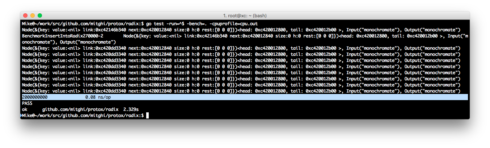

# containers

Developing efficient data structure require designing algorithms capable of making effective use of system resources. This process needs to take advantage of data types in use and finding superior solution. A design may prefer this approach to minimise expenses such as recurrent memory allocation and maximising the benefits by exploiting runtime facilities such as GC, use lock-free and wait-free data structures when appropriate.

## Radix



Words 1 : `"romane", "romanus", "romulus", "rubens", "ruber", "rubicon", "rubicundus"`

Words 2 : `"monochroic", "monochroics", "monochromasies", "monochromasy", "monochromat", "monochromate", "monochromates", "monochromatic", "monochromatically", "monochromaticities", "monochromaticity", "monochromatics", "monochromatism", "monochromatisms", "monochromator", "monochromators", "monochromats", "monochrome", "monochromes", "monochromic", "monochromical", "monochromies", "monochromist","monochromists"`

```
=== RUN   TestRadixNormal
|                                                  |
|r                                                 |
|..om                                              |
|....an                                            |
|......e                                          +|
|......us                                         +|
|....ulus                                         +|
|..ub                                              |
|....e                                             |
|......ns                                         +|
|......r                                          +|
|....ic                                            |
|......on                                         +|
|......undus                                      +|
--- PASS: TestRadixNormal (0.00s)
=== RUN   TestRadix2
|                                                  |
|monochro                                          |
|..ic                                             +|
|....s                                            +|
|..m                                               |
|....a                                             |
|......s                                           |
|........ies                                      +|
|........y                                        +|
|......t                                          +|
|........e                                        +|
|..........s                                      +|
|........i                                         |
|..........c                                      +|
|............ally                                 +|
|............it                                    |
|..............ies                                +|
|..............y                                  +|
|............s                                    +|
|..........sm                                     +|
|............s                                    +|
|........or                                       +|
|..........s                                      +|
|........s                                        +|
|....e                                            +|
|......s                                          +|
|....i                                             |
|......c                                          +|
|........al                                       +|
|......es                                         +|
|......st                                         +|
|........s                                        +|
--- PASS: TestRadix2 (0.01s)
PASS
ok      github.com/mitghi/protox/containers     0.412s
BenchmarkFindInRadix270000-2                    2000000000               0.00 ns/op
BenchmarkInsertIntoRadix270000-2                2000000000               0.08 ns/op
BenchmarkInsertAndFindInRadix270000-2           2000000000               0.08 ns/op
Node(&{key: value:<nil> link:0xc4214221c0 next:0xc420014840 size:0 h:0 isbnd:false rest:[0 0]})<head: 0xc420014800, tail: 0xc421519340>, Input("monochromate"), Output("monochromate")
Node(&{key: value:<nil> link:0xc4214221c0 next:0xc420014840 size:0 h:0 isbnd:false rest:[0 0]})<head: 0xc420014800, tail: 0xc421519340>, Input("monochromate"), Output("monochromate")
Node(&{key: value:<nil> link:0xc4214221c0 next:0xc420014840 size:0 h:0 isbnd:false rest:[0 0]})<head: 0xc420014800, tail: 0xc421519340>, Input("monochromate"), Output("monochromate")
Node(&{key: value:<nil> link:0xc4214221c0 next:0xc420014840 size:0 h:0 isbnd:false rest:[0 0]})<head: 0xc420014800, tail: 0xc421519340>, Input("monochromate"), Output("monochromate")
Node(&{key: value:<nil> link:0xc4213c21c0 next:0xc420014840 size:0 h:0 isbnd:false rest:[0 0]})<head: 0xc420014800, tail: 0xc4214b5340>, Input("monochromate"), Output("monochromate")
Node(&{key: value:<nil> link:0xc4213c21c0 next:0xc420014840 size:0 h:0 isbnd:false rest:[0 0]})<head: 0xc420014800, tail: 0xc4214b5340>, Input("monochromate"), Output("monochromate")
Node(&{key: value:<nil> link:0xc4213c21c0 next:0xc420014840 size:0 h:0 isbnd:false rest:[0 0]})<head: 0xc420014800, tail: 0xc4214b5340>, Input("monochromate"), Output("monochromate")
Node(&{key: value:<nil> link:0xc4213c21c0 next:0xc420014840 size:0 h:0 isbnd:false rest:[0 0]})<head: 0xc420014800, tail: 0xc4214b5340>, Input("monochromate"), Output("monochromate")
Node(&{key: value:<nil> link:0xc4213ca1c0 next:0xc420014840 size:0 h:0 isbnd:false rest:[0 0]})<head: 0xc420014800, tail: 0xc4214bd340>, Input("monochromate"), Output("monochromate")
Node(&{key: value:<nil> link:0xc4213ca1c0 next:0xc420014840 size:0 h:0 isbnd:false rest:[0 0]})<head: 0xc420014800, tail: 0xc4214bd340>, Input("monochromate"), Output("monochromate")
Node(&{key: value:<nil> link:0xc4213ca1c0 next:0xc420014840 size:0 h:0 isbnd:false rest:[0 0]})<head: 0xc420014800, tail: 0xc4214bd340>, Input("monochromate"), Output("monochromate")
Node(&{key: value:<nil> link:0xc4213c21c0 next:0xc420014840 size:0 h:0 isbnd:false rest:[0 0]})<head: 0xc420014800, tail: 0xc4214b5340>, Input("monochromate"), Output("monochromate")
Node(&{key: value:<nil> link:0xc4213c21c0 next:0xc420014840 size:0 h:0 isbnd:false rest:[0 0]})<head: 0xc420014800, tail: 0xc4214b5340>, Input("monochromate"), Output("monochromate")
PASS
ok      github.com/mitghi/protox/containers     11.056s
```


