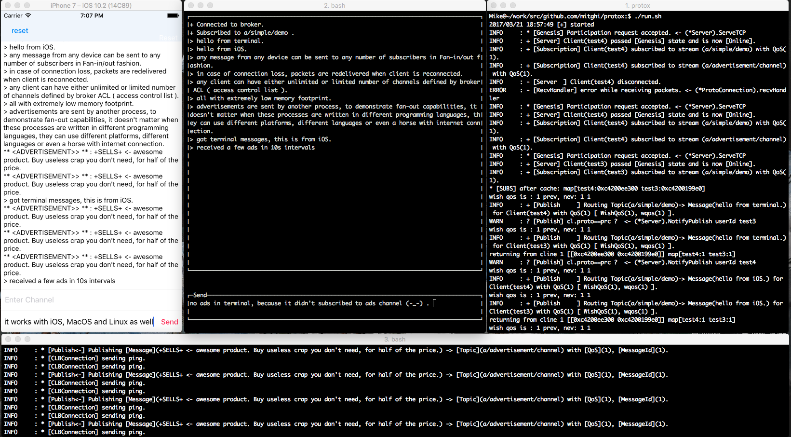

# Demos



# Examples


Using sample Protox **Broker**.


```go
package main

import (
	"os"

	auth "github.com/mitghi/protox/auth"
	protox "github.com/mitghi/protox/broker"
)

var (
	broker      *protox.Broker
	credentials []*auth.Creds
)

func main() {
	// set sample client credentials
	credentials = []*auth.Creds{
		{Username: "test", Password: "$2a$06$lNi8H5kc5Z9T9xJAXwQqyunl2EYhGUi6ct3TgpR1BNb1vpzpp9pzC", ClientId: ""},
		{Username: "test2", Password: "$2a$06$2uqusEvRMcpla2KXph8sBuBXO4WVOgIVbIgfRjk5y01UXxxgR9z6O", ClientId: ""},
		{Username: "test3", Password: "$2a$06$sgQ9yjjVvRxQhLqWKSGv4OTE2EF4ojUu1sEHnGUJdimmn.5M9M7/.", ClientId: ""},
		{Username: "test4", Password: "$2a$06$9wavlAtmNZ66Whe2wturDO7yIBdE41/Zcn4c5z4ydzJ/ydVJIZwJK", ClientId: ""},
	}
	// initialize the broker
	broker = protox.NewBroker(protox.Options{}).(*protox.Broker)
	// register clients from credentials list
	broker.RegisterClients(credentials)
	// run the broker
	ok := broker.Start()
	if !ok {
		os.Exit(1)
	}
	// wait for termination conditions such
	// as (KILL SIGNAL, FATAL ERRORS, .... ).		
	<-broker.E

	os.Exit(0)
}
```

Implementing a simple Protox **Broker** using Protox subsystems.


```go
package main

import (
	"log"
	"net"
	"os"
	"os/signal"
	"sync"
	"syscall"
	"time"

	"github.com/mitghi/protox/auth"
	"github.com/mitghi/protox/client"
	"github.com/mitghi/protox/messages"
	"github.com/mitghi/protox/protobase"
	"github.com/mitghi/protox/protocol"
	"github.com/mitghi/protox/server"
)

// ADDR is the server address.
// Default port is 0xcead.
const ADDR = ":52909" // :0xcead

// Exit timeout
// Server will forcefully terminated
// if it fails to exit before this
// deadline.
var DSTDWN time.Duration = time.Second * 5

// ClientStore holds reference to allocated
// `protobase.ClientInterface` implementors.
// It reuses the structure in the mapping,
// if a client exists.
type ClientStore struct {
	sync.RWMutex
	clients map[string]protobase.ClientInterface
}

// Add updates/adds a client `cid` to its struct pointer.
func (cls *ClientStore) Add(cid string, ptr protobase.ClientInterface) {
	cls.Lock()
	cls.clients[cid] = ptr
	cls.Unlock()
}

// Get fetches a client `cid` from the mapping. It returns a null
// pointer when client doesn't exist.
func (cls *ClientStore) Get(cid string) protobase.ClientInterface {
	cls.RLock()
	v, ok := cls.clients[cid]
	cls.RUnlock()
	if ok == true {
		return v
	}
	return nil
}

var (
	authenticator *auth.Authentication   // authenticator implements `protobase.AuthInterface`
	msgstore      *messages.MessageStore // msgstore implements `protobase.MessageStore`
	s             *server.Server         // s implements `protobase.ServerInterface`
	exitch        <-chan struct{}
	sigs          chan os.Signal
	clstore       *ClientStore
)

// CreateDummyCredentials adds a few fake users to authenication subsystem.
func createDummyCredentials() {
	var creds []*auth.Creds = []*auth.Creds{
		{Username: "test", Password: "$2a$06$lNi8H5kc5Z9T9xJAXwQqyunl2EYhGUi6ct3TgpR1BNb1vpzpp9pzC", ClientId: ""},
		{Username: "test2", Password: "$2a$06$2uqusEvRMcpla2KXph8sBuBXO4WVOgIVbIgfRjk5y01UXxxgR9z6O", ClientId: ""},
		{Username: "test3", Password: "$2a$06$sgQ9yjjVvRxQhLqWKSGv4OTE2EF4ojUu1sEHnGUJdimmn.5M9M7/.", ClientId: ""},
		{Username: "test4", Password: "$2a$06$9wavlAtmNZ66Whe2wturDO7yIBdE41/Zcn4c5z4ydzJ/ydVJIZwJK", ClientId: ""},
	}
	for _, cred := range creds {
		authenticator.Register(cred)
	}
}

// ClientDelegate creates a new handler for each new client and returns a structure
// compatible with `protocol.ClientInterface`. Most of high-level business logic should
// be implemented by customizing/providing a compatible `protocol.ClientInterface` structure.
// Protocol notifications such as Subscribe, Publish, Disconnect, Presence, Request, Broadcast
// and Proposals are delivered by calling delegate routines on the structure returned by this function.
// It will reuse the memory if a client struct is already in the storage, otherwise it allocate and
// returns a new one.
func clientDelegate(username string, password string, cid string) protobase.ClientInterface {
	log.Println("* [clientDelegate] client ", username, " joined.")
	if ret := clstore.Get(username); ret != nil {
		log.Println("** [clientDelegate] reusing existing struct for client: ", username)
		return ret
	}
	var cl *client.Client = client.NewClient(username, password, cid)
	clstore.Add(username, cl)
	return cl
}

// ConnectionDeleagte creates a new connection for each new client
// and returns a compatible structure with `protocol.ProtoConnection` interface.
func connectionDelegate(cl net.Conn) protobase.ProtoConnection {
	var proto *protocol.Connection = protocol.NewConnection(cl)
	return proto
}

func main() {
	log.Println("[+]Started")

	sigs = make(chan os.Signal, 1)
	// initialize clstore
	clstore = &ClientStore{}
	clstore.clients = make(map[string]protobase.ClientInterface)
	// initialize authenication subsystem
	authenticator = auth.NewAuthenticator()
	msgstore = messages.NewMessageStore()
	msgstore.Init()
	createDummyCredentials()
	// initialize a new Protox server
	s = server.NewServer()
	// server sends notifications about fatal errors on this channel
	exitch = s.GetErrChan()
	// server and `ProtoConnection` implementor use this delegate
	// to authenicate clients
	s.SetAuthenticator(authenticator)
	// server uses this delegate to create new connections
	s.SetConnectionHandler(connectionDelegate)
	// server passes this delegate to `ProtoConnection` implementor
	// to create `ClientInterface` delegate
	s.SetClientHandler(clientDelegate)
	// set maximum idle time
	s.SetHeartBeat(5)
	// set persistent storage for incoming and outgoing packets
	s.SetMessageStore(msgstore)
	// fully setup server internals before going to listening mode
	s.Setup()
	// run main tcp handler
	go s.ServeTCP(ADDR)
	// register signals
	signal.Notify(sigs, syscall.SIGINT, syscall.SIGKILL)
	// check events
	select {
	case <-sigs:
		log.Printf("[X] received SIGINT, shutting down ....\n")
		break
	case <-exitch:
		log.Printf("[X] fatal error occured inside broker.\n")
	}
	// handle statuses
	if stat := s.GetStatus(); stat == protobase.ServerRunning {
		var (
			ch  <-chan struct{}
			err error
		)
		ch, err = s.Shutdown()
		if err != nil {
			log.Println("[-----unable-to-shutdown-gracefully-----]")
			log.Println("[-] Shutdown failed.")
			os.Exit(1)
		}
		// terminate with timeout
		select {
		case <-time.After(DSTDWN):
			log.Println("[-----unable-to-shutdown-before-timeout-----]")
			log.Println("[-] Shutdown failed.")
			os.Exit(1)
		case <-ch:
			break
		}
	}
	log.Printf("[+] Shutdown completed.")

	os.Exit(0)
}
```
